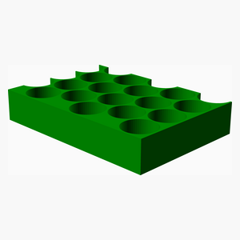
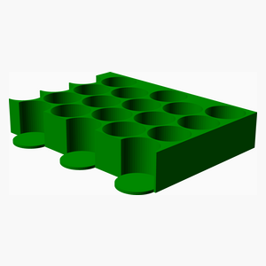

# EOTray
This is a tray foe essential oil bottles. It is designed to fit inside a box
Din A4 footprint. The tray is divided into four pieces to fit on a standard 
3D printer bed.

---
## Table of Contents
1. [Parts list](#Parts_list)
1. [Main Assembly](#main_assembly)

[Top](#TOP)

---

## Parts list
| Main | TOTALS |  |
|---:|---:|:---|
|  | | **3D printed parts** |
| &nbsp;&nbsp;2&nbsp; |  &nbsp;&nbsp;2&nbsp; | &nbsp;&nbsp;EOTray_q1.stl |
| &nbsp;&nbsp;2&nbsp; |  &nbsp;&nbsp;2&nbsp; | &nbsp;&nbsp;EOTray_q2.stl |
| &nbsp;&nbsp;1&nbsp; |  &nbsp;&nbsp;1&nbsp; | &nbsp;&nbsp;EOTray_reducer.stl |
| &nbsp;&nbsp;5&nbsp; | &nbsp;&nbsp;5&nbsp; | &nbsp;&nbsp;Total 3D printed parts count |

[Top](#TOP)

---

## Main Assembly
### 3D Printed parts

| 2 x EOTray_q1.stl | 2 x EOTray_q2.stl | 1 x EOTray_reducer.stl |
|---|---|---|
|  |  |  

### Assembly instructions

1. Print each type of corner piece (EOTray_q1 and EOTray_q1) twice.
2. Glue the pices together if desired.
3. Print as many reducer pieces as required 

[Top](#TOP)
